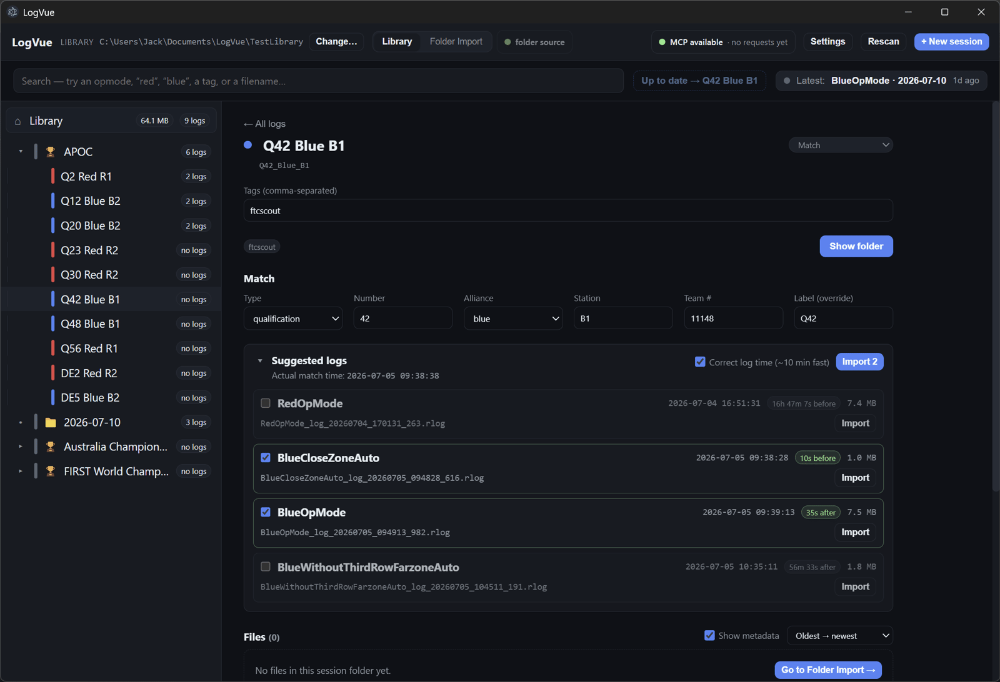
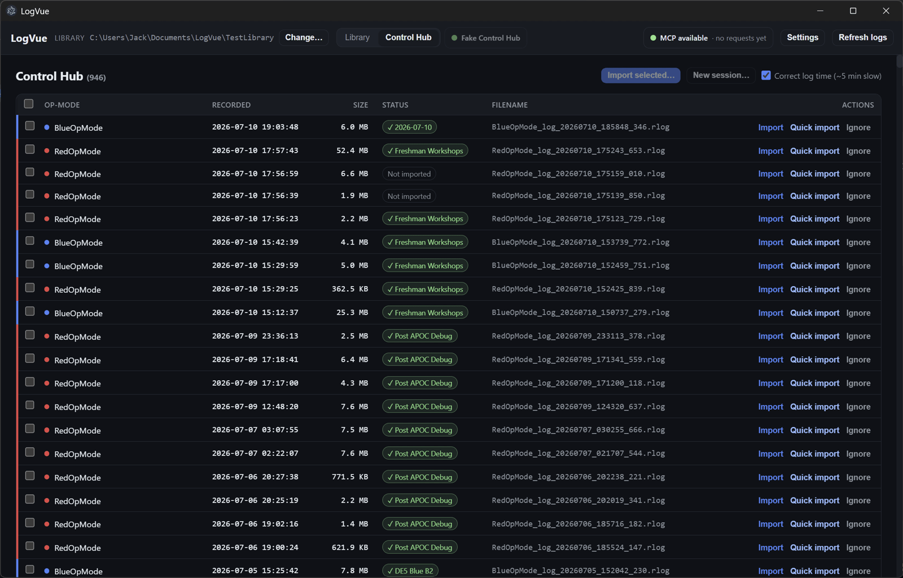
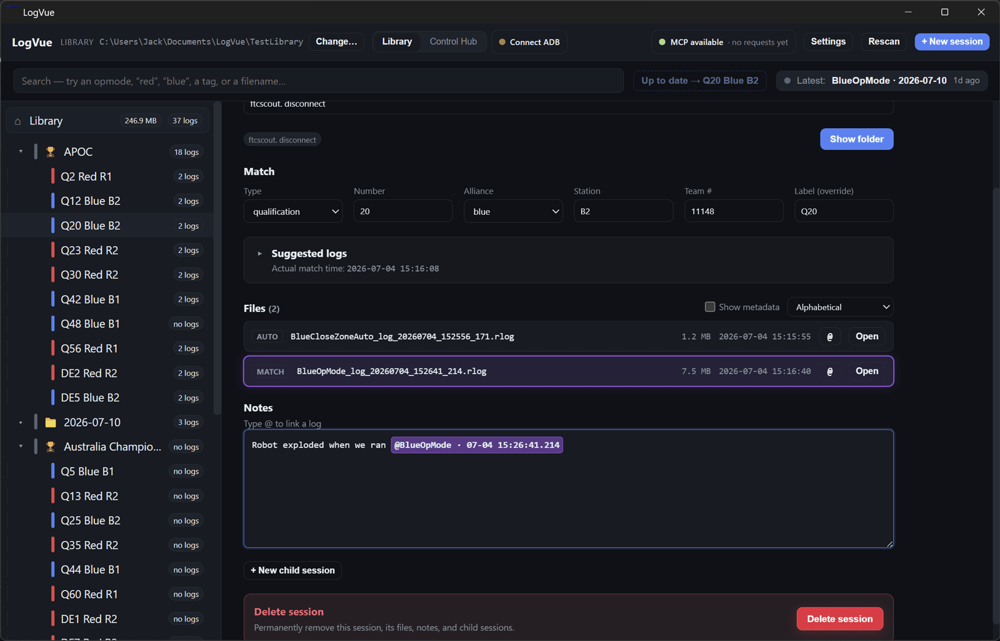

# LogVue

LogVue is a desktop app for organising and reviewing FTC Control Hub RLOG files. It turns a folder of raw logs into a searchable library of sessions, with match metadata, notes, and links back to the exact logs involved. It is also designed for agentic workflows: the archive stays readable through ordinary filesystem tools, while MCP handles live Control Hub operations.

<p align="center">
  
</p>

## What it does

- Imports logs from a Control Hub over ADB or from a local folder.
- Suggests logs for a match using their recorded timestamps.
- Organises sessions into libraries, events, matches, and child sessions.
- Supports searching by op-mode, alliance, tags, filenames, and other session details.
- Adds match metadata, tags, and rich-text notes to sessions.
- Links notes directly to logs so an observation can highlight the relevant file.
- Syncs event and match data from FTCScout.
- Keeps session metadata and notes in filesystem-readable `session.json` and `notes.md` sidecars for agentic browsing.
- Provides MCP tools for live Control Hub status, log discovery, session creation, and managed importing.

## Agentic support

Agents can browse the archive through the filesystem and use MCP for live Control Hub operations and RLOG importing.

## Workflows

### Import logs

When a match has been created, LogVue compares the match time with available Control Hub logs and suggests the most likely files. Select the logs to import and LogVue copies them into the session while preserving their metadata.

### Browse the Control Hub

The Control Hub view lists available RLOG files with op-mode, timestamp, size, import status, and filename. Logs can be imported individually, in batches, or into a new session.

<p align="center">
  
</p>

### Highlight logs from notes

Mention a log from the Notes editor with `@`. Selecting the mention brings the matching log into focus, making it easy to move from an observation to the evidence behind it.

<p align="center">
  
</p>

## Development

```sh
npm install
npm run dev
```

Run the type checks with:

```sh
npm run typecheck
```

LogVue is released under the BSD 3-Clause License. See [LICENSE](LICENSE) and [THIRD_PARTY_NOTICES.txt](THIRD_PARTY_NOTICES.txt).
